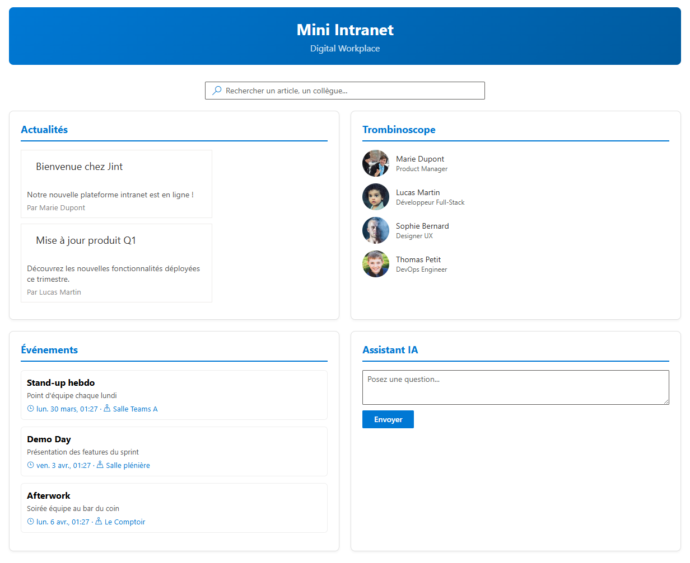

# Mini Intranet

Mini Digital Workplace full-stack inspiré de [Jint](https://www.jint.com) (ex-Mozzaik365).

## Mon Objectif

Démontrer la maîtrise d'une stack moderne (React, C#, Python) à travers un intranet d'entreprise avec widgets collaboratifs et service IA.

## Aperçu



## Architecture
```
Frontend (React + TypeScript + Fluent UI) → port 3000

Backend (C# / ASP.NET Core Web API) → port 5247

AI Service (Python / FastAPI) → port 8000
```

## Stack technique

| Service | Technologies |
|---------|-------------|
| Frontend | React, TypeScript, Fluent UI |
| Backend | C# / ASP.NET Core, REST API, Swagger |
| IA | Python, FastAPI |

## Lancer Le Projet

### Prérequis
- Node.js (LTS)
- .NET SDK 8+
- Python 3.10+

### 1. Backend
```bash
cd backend
dotnet run
```

### 2. Service IA
```bash
cd ai-service
pip install fastapi uvicorn
uvicorn main:app --reload --port 8000
```

### 3. Frontend
```bash
cd frontend
npm install
npm start
```

Ouvrir http://localhost:3000

## Fonctionnalités

- **News Feed** — Articles internes avec CRUD
- **Trombinoscope** — Annuaire de l'équipe avec avatars
- **Calendrier** — Événements à venir
- **Recherche live** — Recherche instantanée articles + collègues
- **Assistant IA** — Chatbot, résumé d'article, traduction (mock)
- **Swagger** — Documentation API auto-générée

## Améliorations possibles

- Base de données (Azure Cosmos DB ou SQLite)
- Authentification (Azure AD / MSAL)
- Intégration Microsoft Graph API
- Vrai modèle IA (OpenAI / Mistral)
- Déploiement Azure